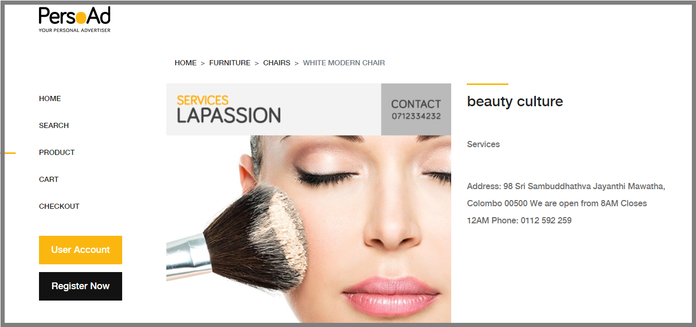
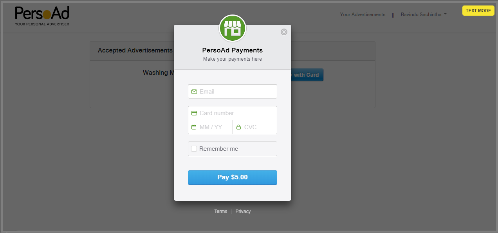

 &nbsp;&nbsp;&nbsp;&nbsp; 
## Online System for Personal Advertisements

### Introduction
There are many sites that provides users to post advertisements about products, or else 
to contact public users to provide services. There is no specific system to provide 
a common platform to publish any type of advertisement. Also when users can add many types of advertisements, 
unnecessary junks can be added to the system.

<br>


<br>



<br>



<br>

### Project Scope

**IN SCOPE**
- Full featured dynamic website with member registration facility and publishing personal advertisements facility.
  - Any public user can register into the system and create their profile in order to post advertisements. The system also provides the facility to select a category that the advertisement should be appeared to the public and for that, a variety of categories will be added to the system.
- Administration System 
  - Administrative interface as a part of the main system in order to perform administrative functionalities of the system.

**OUT SCOPE**
- The system does not concern about communications between the users posting advertisements and the buyers who wants to contact the advertisements.
- The interface for the buyers.

<br>

### Used Technologies

- [Laravel as Backend Framework](https://laravel.com/)
- [Stripe as Payment Gateway](https://stripe.com/)

<br>

### Installation Guidance

**PREREQUISITES**

- Latest Version of Laravel Framework with Composer
- Stripe account (For payment section / Optional)

**HOW TO INSTALL**

- Fork and clone the github repository of the project.
- Run following bash commands inside your project directory as the order.

```console
shell:~$ composer install
.........................
.........................
shell:~$ php artisan migrate
.........................
.........................
shell:~$ php artisan storage:link
.........................
.........................
```

- Then add the following code segment into the end of your .env file

```
STRIPE_PUB_KEY=<Your Stripe Account Public Key>
STRIPE_SECRET_KEY=<Your Stripe Account Secret Key>
```

- Finally run the web server and go to the [http://127.0.0.1:8000](http://127.0.0.1:8000)

```console
shell:~$ php artisan serve
```

<br>

### Developers
<table>
<tr>
<td align="center"></td>
<td align="center"></td>
<td align="center"></td>
<td align="center"></td>
</tr>
<tr>
<td align="center"><a href="https://github.com/RavinduSachintha">Ravindu Sachintha</a></td>
<td align="center"><a href="https://github.com/Nidu96">Nidu Shihani</a></td>
<td align="center"><a href="https://github.com/HiranTharinda">Hiran Tharinda</a></td>
<td align="center"><a href="https://github.com/ChathuriChandima">Chathuri Chandima</a></td>
</tr>
</table>

<br>

### Contributing
Warmly welcome to developers for contributing **PersoAd** Project. Make sure to open an issue and communicate with us before 
creating a Pull Request.

<br>

### License

The PersoAd System is open-sourced software solution licensed under the [GNU General Public License v3.0](./LICENSE).
